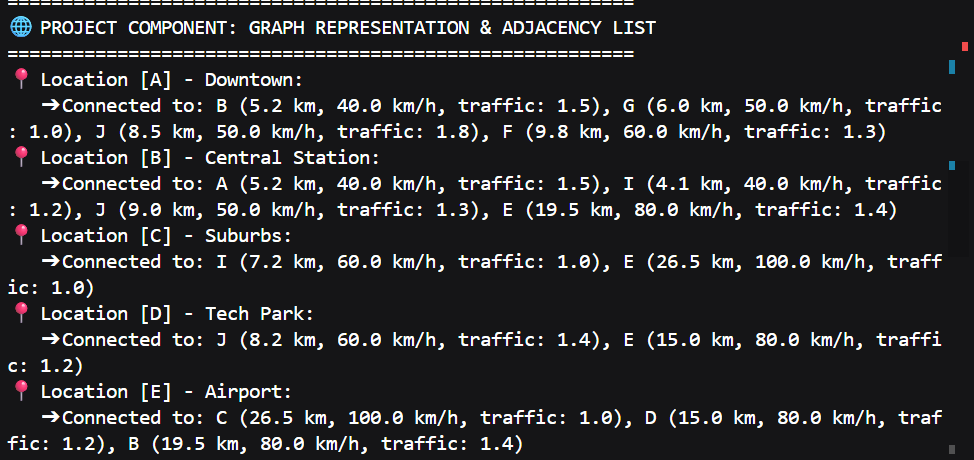
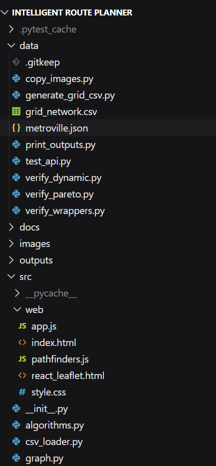
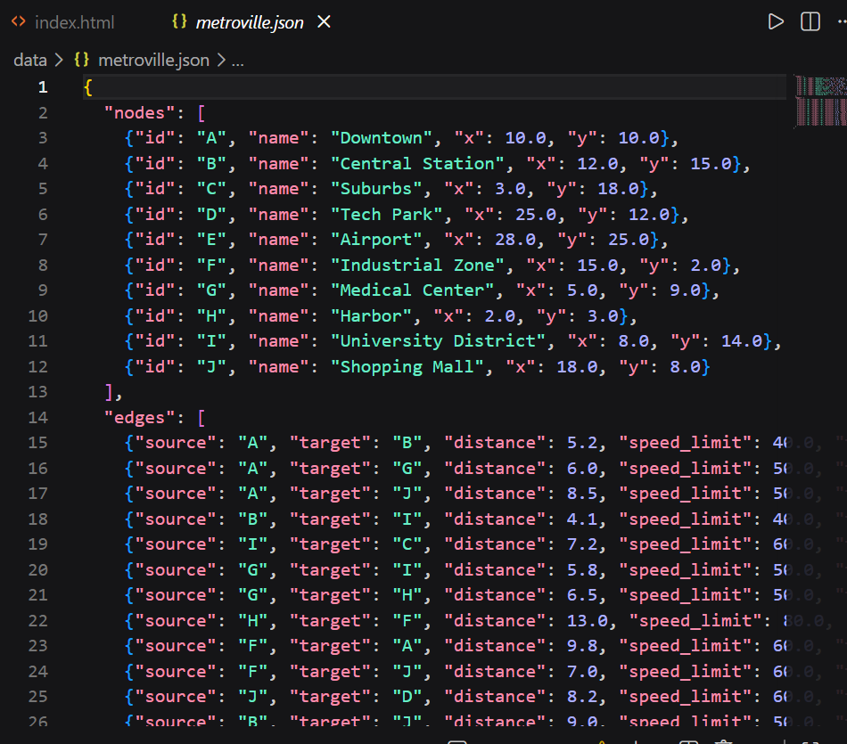
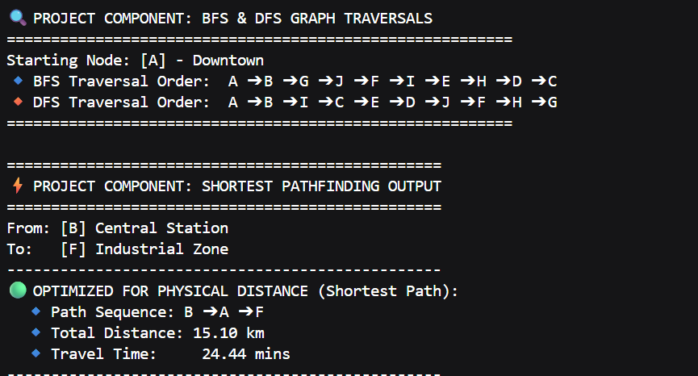
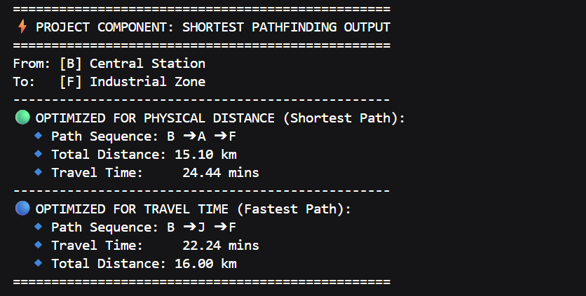

# 🗺️ Intelligent Route Planner Using Graph Algorithms

An industry-grade, recruiter-ready Data Structures and Algorithms (DSA) project demonstrating dynamic pathfinding and routing optimizations in spatial networks. This application features a **FastAPI backend server**, a **React + Leaflet.js interactive map dashboard**, and a **Python/C++ CLI simulation engine**.

---

## 📖 Table of Contents
1. [Project Overview](#-project-overview)
2. [Problem Statement](#-problem-statement)
3. [Core DSA Concepts Used](#-core-dsa-concepts-used)
4. [Algorithms Explained](#-algorithms-explained)
5. [Key Features](#-key-features)
6. [Project Folder Structure](#-project-folder-structure)
7. [Setup & Installation Instructions](#-setup-instructions)
8. [Running the Application](#-running-the-application)
9. [Sample API & CLI Outputs](#-sample-api--cli-outputs)
10. [Visual Simulator Dashboards](#-visual-simulator-dashboards)
11. [Running the Unit Tests](#-running-the-unit-tests)
12. [Learning Outcomes](#-learning-outcomes)

---

## 🗺️ Project Overview
The **Intelligent Route Planner** is a spatial-computing application that calculates optimal paths across transit networks. Similar to routing engines powering **Google Maps, Uber, and Swiggy**, it models a city as a directed graph where intersections are vertices and roads are weighted edges. Weights adjust dynamically based on physical distances, speed limits, and traffic congestion.

The backend is written in Python (FastAPI), running calculations using a **custom-built Binary Min-Heap (Priority Queue)** for Dijkstra's algorithm. It supports Yen's $K$-shortest paths, Pareto-frontier multi-criteria optimization, dynamic road closures, and intersection turn penalties. The frontend is built using React and Leaflet.js, offering interactive mapping.

---

## ⚠️ Problem Statement
In navigation systems, finding a path is easy, but finding the *optimal* path under changing real-world constraints is computationally hard:
1. **Dynamic Cost Modeling:** Travel time fluctuates due to traffic, road closures, and speed limits.
2. **Turn Delays:** Intersection transitions (making sharp turns) introduce deceleration delays that standard routing engines ignore.
3. **Multi-Objective Optimization:** Users face trade-offs (e.g. a path is physically shorter but slower due to traffic, or faster but requires toll fees).
4. **Computational Efficiency:** Standard pathfinders run in $O(V^2)$ time. To scale, systems require optimized priority queues ($O((V+E)\log V)$) and search heuristics (A* Search) to prune search spaces.

---

## 🧠 Core DSA Concepts Used

### 1. Adjacency List Graph representation
Instead of an Adjacency Matrix ($O(V^2)$ space), the transit grid is stored as a hash-map of node IDs mapping to lists of `Edge` objects. This achieves **$O(V + E)$ space efficiency**, which is ideal for sparse networks (such as cities, where intersections link to only 3–4 neighbors).



### 2. Custom Binary Min-Heap (Priority Queue)
Standard priority queue structures do not support an efficient **Decrease-Key** operation in $O(\log V)$ time. Our custom `MinHeap` implements a **position index-lookup map**:
* **Position Map:** Maps `node_id ➔ index_in_array` in $O(1)$ time.
* **Heap Swap Updates:** When swapping elements in the heap array, the position map is updated in $O(1)$.
* **Benefit:** Allows Dijkstra's edge relaxation to find and update a node's priority in **$O(\log V)$** time, yielding a total runtime of **$O((V + E) \log V)$**.

### 3. Edge Relaxation & Greedy Choice
Dijkstra utilizes a greedy choice property, extracting the absolute closest node and updating neighbor costs if:
$$\text{dist}[v] > \text{dist}[u] + \text{weight}(u, v)$$

---

## 🧩 Algorithms Explained

### 1. Dijkstra's Algorithm (Uniform Cost Search)
* **Objective:** Computes the absolute shortest path on positive-weighted graphs.
* **Pluggable Architecture:** Receives a dynamic cost callable callback (`cost_fn`) allowing it to optimize for distance, time, tolls, or eco-scores.
* **Time Complexity:** $O((V + E) \log V)$ using our custom Min-Heap.

### 2. A* Search (Heuristic-Guided Search)
* **Objective:** Prunes the search space by adding a coordinate distance heuristic.
* **Heuristic Function:** $f(n) = g(n) + h(n)$, where $g(n)$ is actual cost and $h(n)$ is the **straight-line Euclidean distance** to the target. For the "time" metric, it is divided by the max speed limit to remain **admissible** (never overestimating).
* **Time Complexity:** $O((V + E) \log V)$ worst-case; significantly faster than Dijkstra on average.

### 3. Yen's $K$-Shortest Paths Algorithm
* **Objective:** Calculates the top $K$ alternative loopless routes.
* **Mechanism:** Iteratively selects nodes in the primary shortest path, designates them as "spur nodes", blocks overlapping path prefixes, and calculates detour branches.
* **Time Complexity:** $O(K \cdot V \cdot (V + E \log V))$.

### 4. Pareto-Dominance Frontier Filter
* **Objective:** Filters candidate paths to identify non-dominated options.
* **Dominance Rule:** Path $P_1$ dominates $P_2$ if it is strictly better in one metric (e.g. distance or time) and not worse in the other. Discarding dominated paths leaves the user with optimal trade-off options.

---

## 🚀 Key Features

* **Advanced Algorithms:** Pluggable Dijkstra, A*, Yen's $K$-shortest paths, and Pareto Frontier filtering.
* **Dynamic Traffic & Closures:** Support for dynamic traffic congestion updates and dynamic road closures.
* **Intersection Turn Penalties:** Computes vector-headings at intersections. If the turn angle exceeds $30^\circ$, it applies a time delay (30 seconds) representing turn deceleration.
* **FastAPI Backend Server:** Thread-safe endpoints (`/route` and `/alternatives`) separating client requests.
* **React + Leaflet UI Dashboard:** Geolocated mapping interface displaying route polylines and enabling objective toggling.
* **Matplotlib Rendering:** Automatically saves color-coded static route maps as PNGs.
* **Pytest Suite:** Dynamic test cases validating path correctness and optimality bounds.

---

## 📂 Project Folder Structure

```text
Intelligent-Route-Planner-Graph-Algorithms/
│
├── data/
│   ├── metroville.json     # 10-node, 15-edge spatial network dataset
│   ├── grid_network.csv    # Generated 3x3 grid network dataset
│   ├── generate_grid_csv.py# Script generating grid_network.csv
│   ├── verify_wrappers.py  # Pluggable wrappers validation test
│   ├── verify_dynamic.py   # Closures & turn penalty validation test
│   ├── verify_pareto.py    # Yen's & Pareto validation test
│   └── test_api.py         # Subprocess FastAPI HTTP endpoint test runner
├── src/
│   ├── __init__.py         # Package initializer
│   ├── graph.py            # Node, Edge, Graph structures, BFS, and DFS
│   ├── heap.py             # Custom Binary Min-Heap with Decrease-Key
│   ├── algorithms.py       # Pluggable Dijkstra, A* and turn penalty functions
│   ├── summary.py          # Route summaries and driving directions formatter
│   ├── visualizer.py       # Matplotlib static map rendering wrapper
│   ├── csv_loader.py       # CSV parser and Distance, Time, Toll, Eco cost proxies
│   ├── server.py           # FastAPI web backend server application
│   └── web/
│       ├── index.html      # Standard HTML5 Canvas visualizer
│       ├── style.css       # Visualizer stylesheet
│       ├── pathfinders.js  # Client-side animation pathfinders
│       ├── app.js          # Canvas rendering and event handler loop
│       └── react_leaflet.html # React + Leaflet map dashboard
├── outputs/                # Folder for dynamically generated route PNG plots
├── images/                 # Repository visual assets and diagrams
├── docs/
│   ├── installation_guide.md # Environment compiler commands cheat sheet
│   ├── interview_prep.md   # Interview FAQ sheet and complexity matrices
│   └── architecture_sketch.md # React/Leaflet + FastAPI architecture design
├── README.md               # Main repository documentation
├── requirements.txt        # Third-party dependency list
└── main.py                 # Application CLI runner
```

### 📂 Workspace File Explorer & Graph JSON Dataset

Below is a preview of the clean project directory tree inside VS Code and a snippet of the city coordinates & routing segments stored in `metroville.json`:

| Project Folder Explorer | Metroville JSON Dataset |
| :---: | :---: |
|  |  |

---

## 🛠️ Setup Instructions

### 1. Clone the repository:
```bash
git clone https://github.com/<your-username>/Intelligent-Route-Planner-Graph-Algorithms.git
cd Intelligent-Route-Planner-Graph-Algorithms
```

### 2. Set up virtual environment:
* **Windows (PowerShell):**
  ```powershell
  python -m venv .venv
  .venv\Scripts\Activate.ps1
  ```
* **macOS / Linux:**
  ```bash
  python3 -m venv .venv
  source .venv/bin/activate
  ```

### 3. Install dependencies:
```bash
pip install -r requirements.txt
```

---

## 🏃 Running the Application

### 1. Run the CLI Application:
```bash
python main.py
```
*Prompts for start/target nodes, optimizes by time or distance, prints benchmarks, and saves plots to `outputs/`.*

### 2. Run the FastAPI Server:
```bash
python -m uvicorn src.server:app --reload --host 127.0.0.1 --port 8000
```
*Hosts the REST API endpoints. You can test the endpoints automatically by running `python data/test_api.py`.*

---

## 📊 Sample API & CLI Outputs

### 🔹 Graph traversals & Shortest Pathfinding CLI Outputs
Below are the actual run logs of the system traversing the city network using BFS/DFS algorithms and computing the optimized routing paths:

| BFS & DFS Traversals & Distance Routing | Travel Time Routing |
| :---: | :---: |
|  |  |

### 🔹 CLI Pathfinder Benchmark
Routing from **Downtown (A)** to **Airport (E)**, optimized for **Travel Time**:
```text
---------------------------------------------------------
⚡ ALGORITHM PERFORMANCE BENCHMARK
---------------------------------------------------------
 🔹 Dijkstra's Executed in:  97.80 μs
 🔹 A* Search Executed in:   50.60 μs
 🚀 A* Search was 48.3% faster due to coordinate heuristic pruning!
---------------------------------------------------------
```

### 🔹 API `/alternatives` (Pareto Frontier options from Suburbs C to Tech Park D)
```json
{
  "source": "C",
  "destination": "D",
  "candidates_evaluated_count": 6,
  "pareto_options_count": 2,
  "options": [
    {
      "option_label": "Option A",
      "path": ["C", "I", "B", "J", "D"],
      "total_distance_km": 28.5,
      "total_duration_minutes": 40.1,
      "trade_off": "Shorter distance / Slower duration"
    },
    {
      "option_label": "Option B",
      "path": ["C", "E", "D"],
      "total_distance_km": 41.5,
      "total_duration_minutes": 29.4,
      "trade_off": "Longer distance / Faster duration"
    }
  ]
}
```

---

## 🖼️ Visual Simulator Dashboards

### 1. React + Leaflet Interface
Open [`src/web/react_leaflet.html`](src/web/react_leaflet.html) in your browser:
* Double-click nodes to view popups.
* Toggle objectives (Time, Distance, Weighted).
* Adjust weighted sum sliders and click **Plan Route** to overlay path polylines.

### 2. HTML5 Canvas Playground
Open [`src/web/index.html`](src/web/index.html) in your browser:
* Double-click to spawn new intersections.
* Hold **Shift** and drag to draw roads.
* Watch step-by-step pathfinding animations of Dijkstra vs. A* Search.

---

## 🧪 Running the Unit Tests

We use `pytest` to assert routing constraints and optimality bounds. To execute:
```bash
pytest tests/test_routing.py -v
```

---

## 🎓 Learning Outcomes
By building and reviewing this project, you master:
1. **Practical Graph Theory:** Working with adjacency lists, directed sparse graphs, and coordinate mapping.
2. **Under-the-Hood Heap Internals:** Implementing index lookup maps inside binary heaps to support true $O(\log V)$ decrease-key operations.
3. **Advanced Pathfinding Heuristics:** Implementing admissible, consistent straight-line time estimators.
4. **Multi-Objective Optimization:** Coding Yen's algorithm and evaluating Pareto-dominance frontiers.
5. **Geometry Vector Mathematics:** Computing headings and dot products to calculate intersection turn penalties.
6. **Full-Stack Spatial Integration:** Binding FastAPI backends with React + Leaflet polyline overlays.
